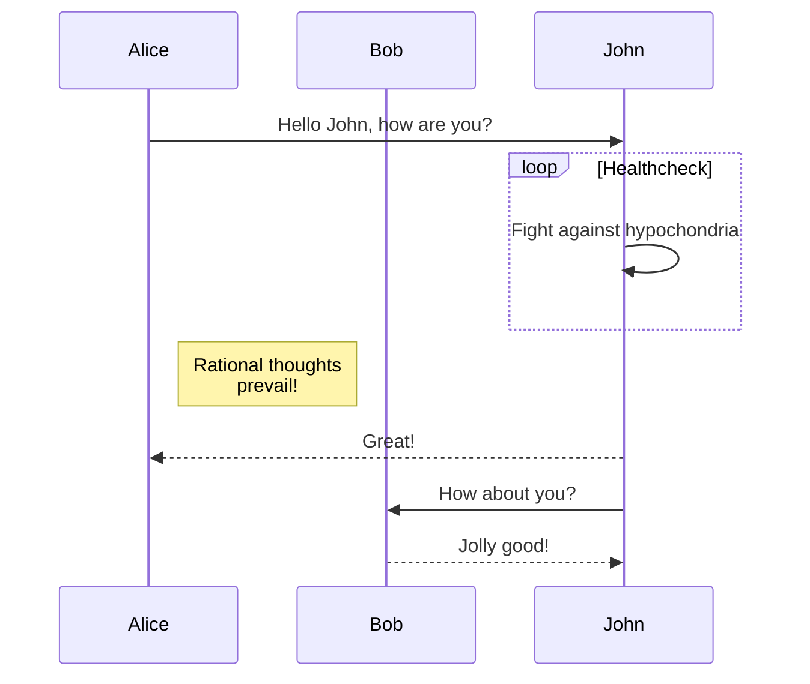

<p align="center">
  
</p>

# Segdev - Backend Desafio 2
Uma seguradora oferece aos seus clientes pacotes personalizados para suas necessidades especificas sem que eles precisem entendem nada sobre seguros.

A seguradora determina as necessidades do cliente atravez de um formulario com informações pessoais e de risco, alem de informações sobre seus veiculos e imoveis. Usando esses dados, é determinado o perfil de risco deles para cada linha de seguros existente, sugerindo um plano de seguro (`"economico"`, `"padrao"`, `"avancado"`) correspondente pro perfil de risco encontrado.

Para esse desafio, você irá criar uma versão simplificada dessa aplicação, escrevendo o recurso de uma API que recebe um payload JSON com as informações do cliente e devolve os planos sugeridos para cada linha de seguros, tambem em JSON.

## Entradas
Primeiro o frontend da aplicação pede ao usuário suas **informações pessoais** e deixa que ele adicione seu **veiculo** e **casa**. No final, é pedido que ele responda tres perguntas binarias sobre **risco**. O resultado é o payload a seguir que é enviado para o recurso da aplicação.

```JSON
{
  "age": 35,
  "dependents": 2,
  "house": {"ownership_status": "owned"},
  "income": 0,
  "marital_status": "married",
  "risk_questions": [0, 1, 0],
  "vehicle": {"year": 2018}
}
```

### Atributos de usuário
Todos os atributos são obrigatórios:

- Age (Idade: Um inteiro maior ou igual a zero).
- Dependents (Numero de dependentes: Um inteiro maior ou igual a zero).
- Income (Renda anual: Um inteiro maior ou igual a zero).
- Status civil (`"single"` or `"married"`).
- Questões de risco (Um array com 3 booleanos).

##### House
Os usuários podem ter 0 ou 1 casa. Quando tem isso é um atributo: `ownership_status`, que pode ser `"owned"` (proprio) ou `"rented"`(alugado).

##### Vehicle
Os usuários podem ter 0 ou 1 veiculo. Quando tem isso é um atributo: `year`, que contem o um inteiro com o ano de fabricação do veiculo.


## O algoritimo
A aplicação recebe o payload pelo recurso da API e transforma isso num perfil de risco atravez do calculo do risk score para cada linha de seguro **(life, disability, home & auto)**, baseado nas informações fornecidas pelo usuario.

Primeiro é calculado o **base score** somando as respostas do formulario de risco, resultrando em um numero de 0 a 3. Depois são aplicadas as seguintes regras para determinar o **risk score** para cada tipo se seguro

- Se o usuário não tem renda, veiculo ou casa, ele é inelegivel para invalidez, seguros auto e residencial, respectivamente.
- Se o usuário tem mais de 60 anos, ele é inelegivel para invalidez e seguro de vida.
- Se o usuário tem menos de 30 anos, diminua 2 pontos de risco de todas as linhas de seguro. Se ele tiver entre 30 e 40, diminua 1.
- Se a renda for superior a 200k, diminua 1 ponto de risco de todas as linhas de seguro.
- Se a casa do usuário é alugada, adicione 1 ponto de risco no seguro residencial e de invalidez
- Se o usuário tem dependentes, adicione 1 ponto em ambos os riscos de invalidez e vida.
- Se o usuario for casado, adicione 1 ponto em vida, e remova 1 ponto em invalidez.
- Se o veiculo dele tiver sido produzido nos ultimos 5 anos, adicione 1 ponto no veiculo.

O algoritimo resulta num score final para cada linha se seguros, que deve ser processada usando os seguintes ranges:

- **0 ou abaixo** ==> **"economico"**.
- **1 ou 2** ==> **"padrao"**.
- **3 ou acima** ==> **"avancado"**.


## A saída
Considerando os dados acima, a aplicação deverá retornar o seguinte JSON payload:

```JSON
{
    "auto": "padrao",
    "disability": "inelegivel",
    "home": "economico",
    "life": "padrao"
}
```

## Critérios

You can choose any technology stack to implement this assignment. Using our stack is not a requirement in the selection process - we will consider exclusively that you build a solid system with an emphasis on code quality, simplicity, readability, maintainability, and reliability, particularly regarding architecture and testing to evaluate your work.

Be aware that Origin will mainly take into consideration the following evaluation criteria:
* How clean and organized your code is;
* If you implemented the business rules correctly;
* How good your automated tests are (qualitative over quantitative).

Other important notes:
* Develop a extensible score calculation engine
* Add to the README file: (1) instructions to run the code; (2) what were the main technical decisions you made; (3) relevant comments about your project 

This assignment should be doable in less than one day. We expect you to learn fast, **communicate with us**, and make decisions regarding its implementation & scope to achieve the expected results on time.

